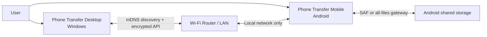
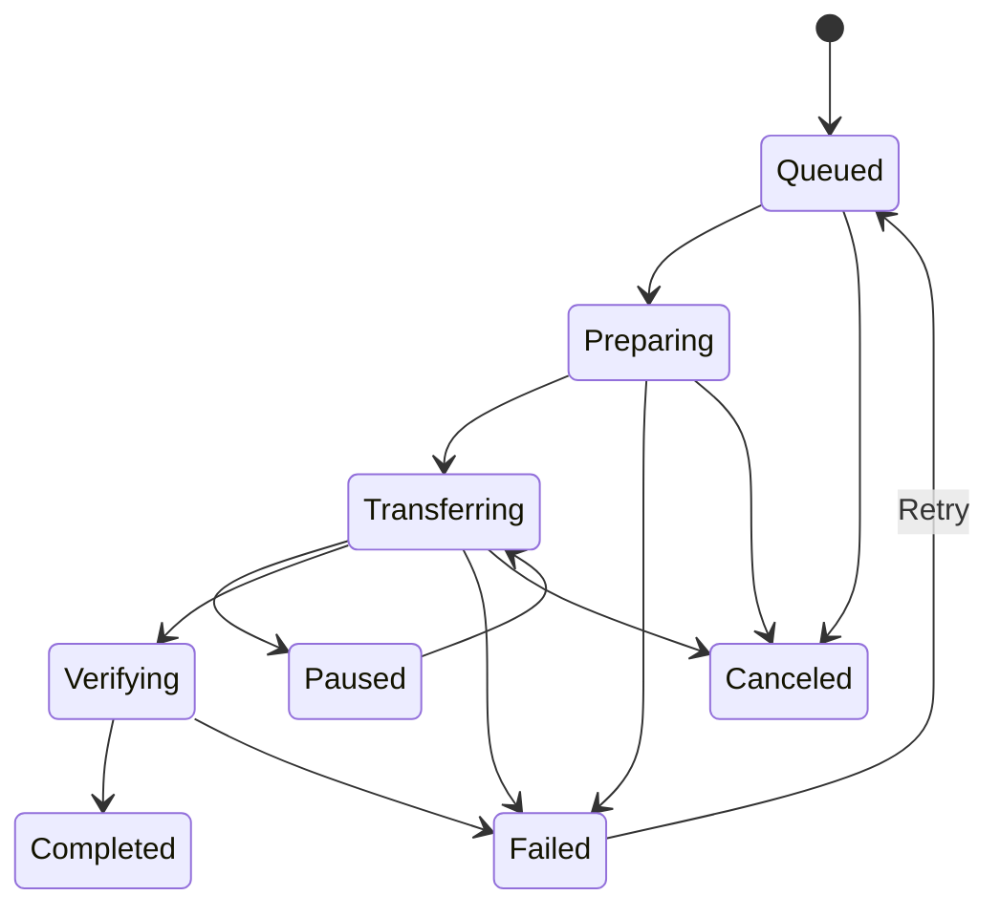

# Phone Transfer Technical Architecture

## 1. System Context



The Android app owns all access to phone content. The Windows app never mounts
the phone as a raw disk and never receives unrestricted filesystem paths.

## 2. Implemented Components

### Windows

- .NET 10 LTS and WPF.
- `HttpClient` for control, transfer, thumbnail, and range requests.
- Windows Credential Manager for trusted-phone profiles and tokens.
- UDP LAN discovery with manual address fallback.
- Windows Mobile Hotspot detection for the direct Wi-Fi workflow.
- A loopback-only HTTP media proxy for WPF media playback.

### Android

- Java 17 with a programmatic Material-style Android UI.
- Storage Access Framework and `DocumentFile`/`DocumentsContract` for standard
  mode.
- A capability-gated direct-path storage adapter for optional
  `MANAGE_EXTERNAL_STORAGE` mode.
- App-private `SharedPreferences` for hashed trusted-device tokens, access
  mode, and persisted grant metadata.
- An app-private long-term TLS identity and certificate fingerprint.
- UDP LAN discovery advertisement.
- A local HTTPS server with streaming request and response support.
- A user-started foreground service and Quick Settings tile.

## 3. Layering

### Shared Protocol

Defines DTOs, error codes, capability flags, version negotiation, operation IDs,
and test fixtures. The wire contract should be represented by an OpenAPI file
and exercised by compatibility tests in both implementations.

### Windows Layers

- **Presentation**: WPF windows and code-behind for connection, browsing,
  transfer, trusted-device, and media workflows.
- **Application**: browsing, pairing, recursive transfer, resume, and conflict
  workflows.
- **Domain**: device, remote item, transfer, and capability models.
- **Infrastructure**: HTTPS client, UDP discovery, Credential Manager, hotspot
  diagnostics, loopback media proxy, and local files.

### Android Layers

- **Presentation**: programmatic Android views and permission flows.
- **Application**: sharing lifecycle, pairing, authorization, and transfers.
- **Storage gateway**: one interface over SAF content URIs and optional broad
  shared-storage paths, always exposed as opaque item IDs.
- **Network server**: authenticated API and streaming endpoints.
- **Platform services**: UDP discovery, foreground notification, Quick
  Settings tile, TLS identity, and app-private preferences.

The Windows media viewer starts a short-lived HTTP proxy bound only to
`127.0.0.1`. It translates media-player byte-range requests into authenticated,
certificate-pinned Android HTTPS requests and does not write a permanent media
file.

## 4. Identity and Pairing

1. Android maintains a long-term TLS identity and advertises its SHA-256
   certificate fingerprint.
2. Windows connects over TLS and pins the advertised fingerprint.
3. The user enters the current Android access code for the first connection.
4. When **Trust this PC** is enabled, Windows sends a stable random client ID
   and display name.
5. Android returns a random trusted token and stores only its SHA-256 hash.
6. Windows stores the trusted token and phone profile in Credential Manager.
7. Later connections use the trusted token even after the access code changes.
8. Either application can revoke an individual trusted relationship.

Pairing must not trust the local network itself. Anyone connected to the Wi-Fi
should be treated as potentially hostile.

The implementation deliberately does not use a device MAC address as the trust
identity. Modern Android and Windows networking can randomize MAC addresses,
and applications cannot reliably read a stable hardware MAC. The random client
ID plus secret token is stable, revocable, and does not expose hardware
identity.

## 5. Storage Model

Every shared Android root receives a random `rootId`. A standard root maps to a
persisted tree URI; an optional broad root maps to an OS-approved shared-storage
volume. Every listed item receives an opaque, signed or server-mapped `itemId`.
API clients use these IDs rather than content URIs or paths.

```text
SharedRoot
  rootId
  displayName
  treeUri
  canRead
  canWrite
  canDelete
  isAvailable

RemoteItem
  itemId
  rootId
  parentId
  displayName
  kind
  mimeType
  size
  modifiedAt
  capabilities
  versionTag
```

The Android server validates that every item remains a descendant of its
authorized root. It must not concatenate user input into filesystem paths.

## 6. Proposed Protocol

Base path: `/api/v1`

### Control Endpoints

```text
GET    /info
POST   /pairing/requests
POST   /pairing/requests/{id}/complete
GET    /roots
GET    /items/{itemId}/children
GET    /items/{itemId}
POST   /folders
PATCH  /items/{itemId}
DELETE /items/{itemId}
POST   /operations/{operationId}/cancel
```

### Transfer Endpoints

```text
POST   /uploads
HEAD   /uploads/{uploadId}
PUT    /uploads/{uploadId}/content
POST   /uploads/{uploadId}/commit
DELETE /uploads/{uploadId}

HEAD   /items/{itemId}/content
GET    /items/{itemId}/content
```

Uploads are streamed and incomplete direct-storage uploads are removed when the
connection ends early. Downloads support complete, open-ended, bounded, and
suffix HTTP range requests. Capability fields tell Windows when resume,
rename, move, or delete is not supported.

### Common Error Shape

```json
{
  "code": "STORAGE_PERMISSION_REVOKED",
  "message": "Access to this shared folder was revoked on the phone.",
  "retryable": false,
  "action": "REAUTHORIZE_ROOT",
  "operationId": "01J..."
}
```

Stable error codes are required for authentication failure, pairing required,
permission denied, item not found, item changed, conflict, insufficient space,
unsupported operation, rate limit, transfer interrupted, and protocol
incompatibility.

## 7. Transfer Lifecycle



Queue records contain stable operation IDs. A reconnect queries server-side
upload state before continuing. Windows downloads use `.phonefolder-part`
temporary files and atomic rename where the destination filesystem supports it.

## 8. Threat Model

### Threats

- A malicious device on the same LAN probes the Android service.
- An attacker impersonates a previously paired phone.
- A crafted item ID escapes an approved root.
- A filename causes traversal or invalid Windows path behavior.
- A client starts unlimited transfers to exhaust memory, storage, or file
  descriptors.
- Logs expose tokens or sensitive filenames.
- A revoked client reuses a cached credential.

### Controls

- Encrypted, authenticated sessions.
- Explicit pairing approval and key fingerprints.
- Opaque item IDs and server-side ancestry checks.
- Strict filename validation on both platforms.
- Request, queue, bandwidth, and concurrency limits.
- Revocation checks on every new session.
- Secret redaction and bounded logs.
- Temporary files plus commit semantics.
- No remote binding, port forwarding, or cloud relay in the MVP.

## 9. Android Lifecycle

Sharing starts only after a direct user action. While active:

1. Start a foreground service with an ongoing notification.
2. Open the local server socket.
3. Advertise the service through NSD.
4. Accept only authenticated requests except the restricted pairing flow.
5. Update the notification during active transfers.
6. Stop advertisement and close sockets when the user taps **Stop sharing**.

The implementation must account for Android foreground-service restrictions and
future local-network runtime permission requirements. It should not attempt to
start persistent sharing silently after boot.

## 10. Testing Strategy

### Unit Tests

- Item authorization and root ancestry.
- Name sanitization and conflict naming.
- Queue state transitions.
- Retry and offset calculations.
- Authentication, expiry, and revocation.
- Protocol serialization and error mapping.

### Integration Tests

- Windows client against an in-memory protocol server.
- Android server against fake document providers.
- Cross-language protocol fixtures.
- Upload commit and interrupted resume.
- Directory pagination and provider capability differences.

### Device Tests

- Android 10, 12, 14, 16, and 17 beta/stable as available.
- Windows 10 22H2 and current Windows 11.
- Internal storage and removable SD card.
- Home router, guest network, hotspot, and access-point-isolation scenarios.
- Sleep, lock, network switch, process kill, low storage, and revoked grants.

### Security Tests

- Unauthenticated endpoint enumeration.
- Replayed pairing codes.
- Tampered IDs and traversal-like filenames.
- Oversized headers and request bodies.
- Excessive parallel requests.
- Revoked and replaced device keys.

## 11. Official Platform References

- [Android Storage Access Framework](https://developer.android.com/guide/topics/providers/document-provider)
- [Android shared document access](https://developer.android.com/training/data-storage/shared/documents-files)
- [Android scoped storage overview](https://developer.android.com/guide/topics/data/data-storage)
- [Android all-files access](https://developer.android.com/training/data-storage/manage-all-files)
- [Android Network Service Discovery](https://developer.android.com/training/connect-devices-wirelessly/nsd)
- [Android local network permission](https://developer.android.com/privacy-and-security/local-network-permission)
- [Android foreground services](https://developer.android.com/develop/background-work/services)
- [.NET support policy](https://dotnet.microsoft.com/en-us/platform/support/policy)
- [WPF overview](https://learn.microsoft.com/en-us/dotnet/desktop/wpf/overview/)
